# Calc-For-Coder
移动互联应用开发-Calc For Coder

## 应用介绍
本应用是为程序员量身打造的一款基于iOS平台的计算器app。 拥有 *进制计算*，*高级计算*，*方程求解*，*统计计算*，*函数绘制* 五个功能模块。

要想切换模块，在任意主界面左滑屏幕，呼出侧面导航栏即可。如下图：

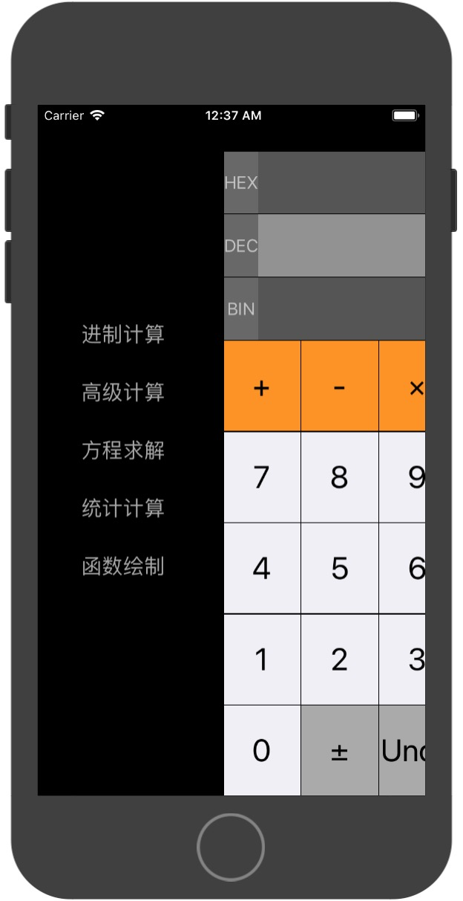

## 功能介绍
### 一、进制计算

此模块为程序进入后默认模块，可进行方便的进制运算。其特点有：

* 进制实时转换，三种进制同时显示。
* 可通过点击上面的进制栏，随机进行进制切换。
* 支持跨进制运算，例如可以用二进制的数与十进制的数相加。
* 变量Ans存储上一次运算结果，可用于下一次计算中。

功能截图如下：

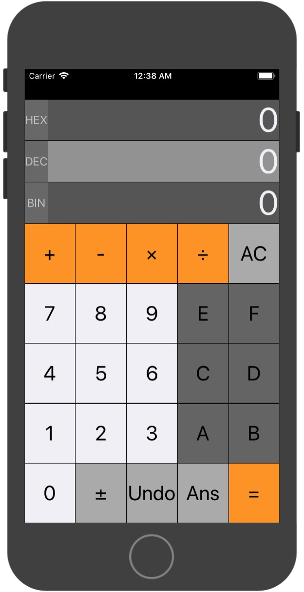

### 二、高级计算

此模块可进行一些较为高级的运算。其特点有：

* 支持阶乘，常量e的幂，x的任意次方，求余等较为高级的运算。
* 屏幕上方能够显示直至当前的运算表达式。
* 添加变量M， 能够储存任意值（运算结果），且可以用于任何计算中。

功能截图如下：

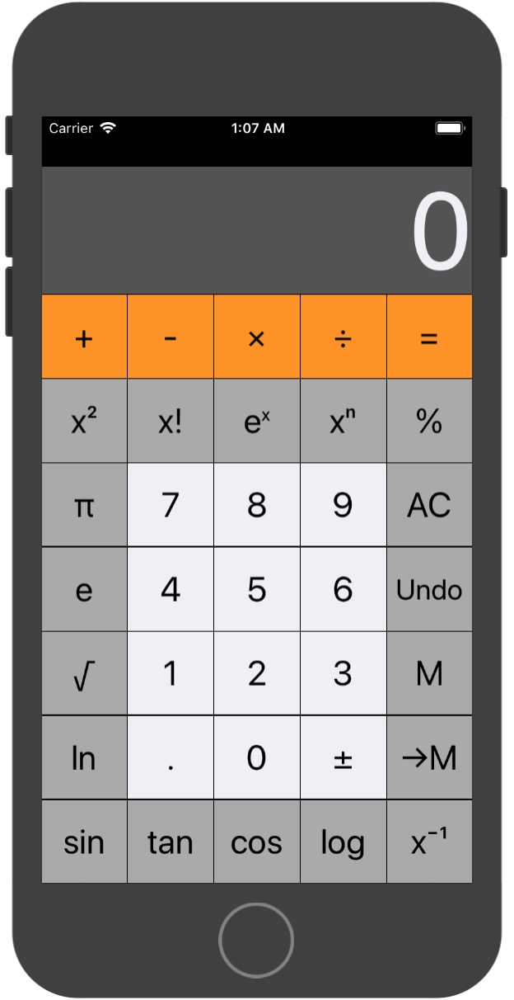

### 三、方程求解

此模块可进行一元二次方程，二元一次方程，三元一次方程的求解。其特点有：

* 用户只需进行参数输入，简单快捷方便。
* 考虑极端情况，提示无解情况

功能截图如下：

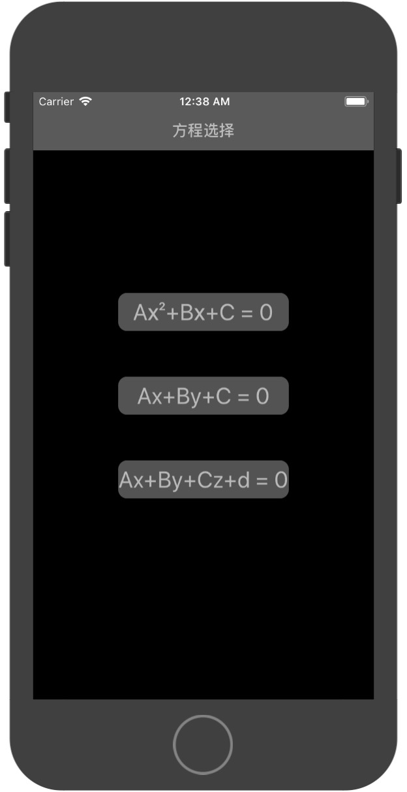

### 四、统计运算

此模块可进行统计学运算。其最大特点为：
* 输入变量后，所有运算结果一股脑送到你眼前，要哪个用哪个。省去常规计算器中再去一个个计算均值，方差等复杂不人性的操作。（本人本学期在学习数理统计，深有体会，
用此App后感觉效率大大提升。可惜期末只能用计算器，不能用手机，哎）

此功能大致运行流程为： **用户输入样本->系统计算对应统计量**

以下为详细说明：

#### 1) 用户输入变量
用户点击屏幕下方的文本框后，开始输入变量，按 + 按钮确认添加。如下图：

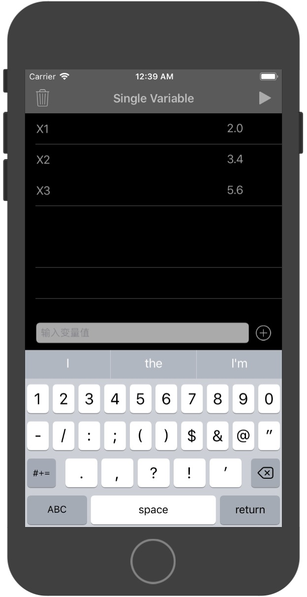

#### 2）用户编辑变量
若有变量输入不正确，可以直接点击数字进行编辑。

#### 3） 用户删除变量
若想要删除变量，点击屏幕左上的
删除按钮，选择相应变量即可，如下图所示：

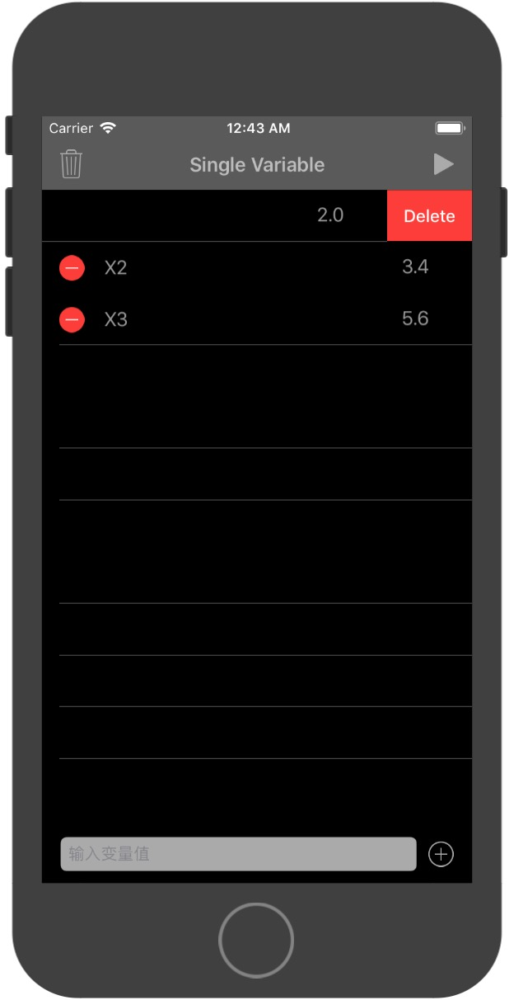

#### 4）计算统计量
变量全部添加完成后，点击右上角的计算按钮，系统即开始运算，并显示结果，如下所示：

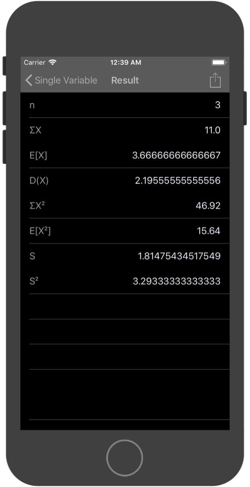

#### 5）结果分享
在显示结果的页面，右上角可见分享按钮，点击即进入发送邮箱界面，邮件正文包含变量以及统计量计算结果，可以发送给他人以供分享或者自己保存下来。
（由于模拟器不支持邮件，此截图由真机进行）如下图所示：

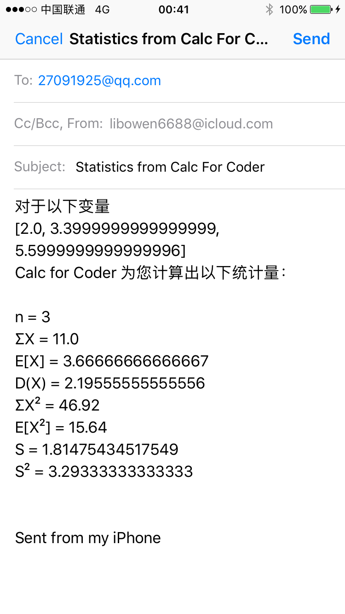

#### 6）重新计算
回到变量输入界面后，若想删除所有变量，可长按左上的删除按钮，在弹出的选择框中点击“Yes”。如下图所示：

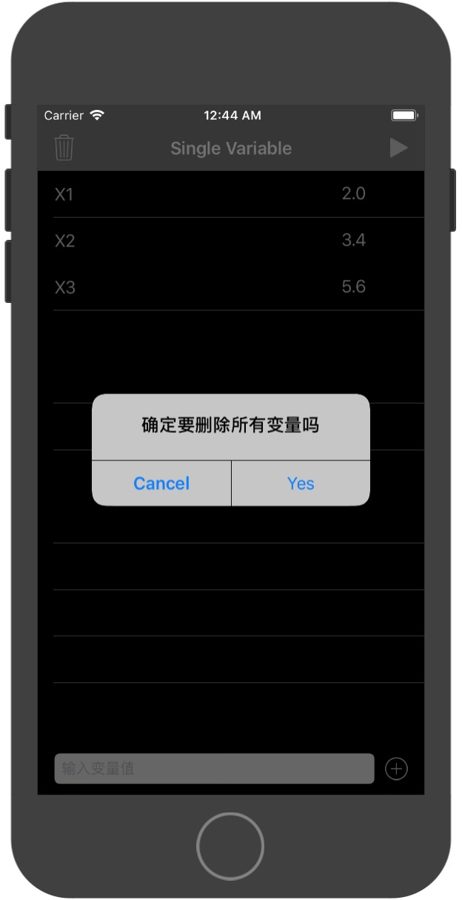

### 五、函数绘制
此模块支持绘制2D函数图像，可以对变量x进行加减乘除，平方，开根号，sin，cos，tan，ln等所有你所能想到的复合操作，并在屏幕上绘制出来。模块特点有：

* 支持复杂的复合运算。
* 函数绘制界面支持拖动，缩放，快速定位原点（双击）等操作。

变量输入界面：
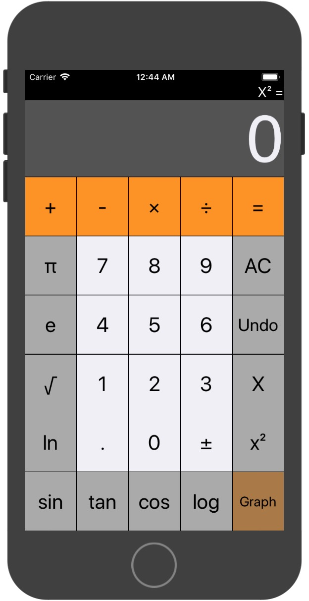
结果显示界面：
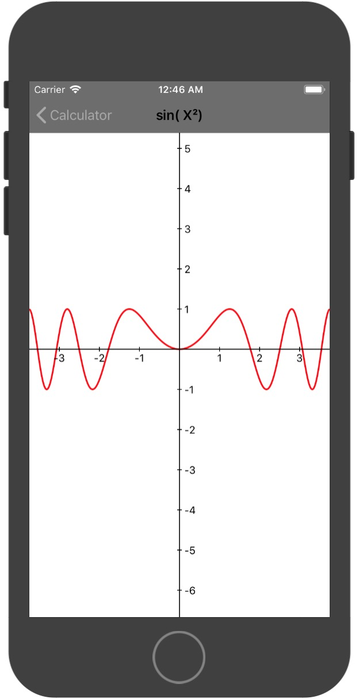

### 结束语
本人在使用此App后，感觉生活质量有所提升，特别是进制运行以及统计运算，实用性比较大。希望此App能对你也有所帮助。

PS： 如果您在使用过程中发现任何bug，欢迎提出！
